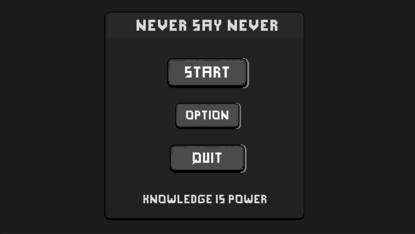

# NsnFramework For Unity
**Framework is Refactoring ! Something will be changed in feature.**  
**To be continue ...**
#
*Unity Version：2021.3.0f1c1*
## Third-Party Plugins
- **[DOTween](https://assetstore.unity.com/packages/tools/animation/dotween-hotween-v2-27676) --- for free**
- **[xlua](https://github.com/Tencent/xLua) --- will be pulished in "NsnFramework.xlua" Branch**
- **[Odin Inspector](https://assetstore.unity.com/packages/tools/utilities/odin-inspector-and-serializer-89041) ---- recommand,not necessary**

Just a sample ui exmaple with UGUI .  

### UI Inspector
How to build UIView ? These are something special in UI Inspector!
- *bind ui controls quickly through using **"Refresh UI Control"** button (extensible)*
- *generate ui view code automatic through **"Generate UI Code"** button (both c# and lua)*

Example : 

```

/*
 *  This part is auto generate !
 */
using TMPro;
using UnityEngine.UI;
using Nsn;

public partial class GameMainPanel : Nsn.UIBaseView
{
    private TextMeshProUGUI mTmpTitle;
    private Button mBtnStart;
    private Button mBtnOption;
    private Button mBtnQuit;

    protected override void OnInitControl()
    {
        base.OnInitControl();
        mTmpTitle = Info.ObjLinks["tmpTitle"] as TMPro.TextMeshProUGUI;
        mBtnStart = Info.ObjLinks["btnStart"] as UnityEngine.UI.Button;
        mBtnOption = Info.ObjLinks["btnOption"] as UnityEngine.UI.Button;
        mBtnQuit = Info.ObjLinks["btnQuit"] as UnityEngine.UI.Button;
    }
}

```
We can just programe for ui logic
```
public partial class GameMainPanel : Nsn.UIBaseView
{
    protected override void OnAwake()
    {
        UIListener.AddButtonClick(mBtnStart,OnBtnClick);
        UIListener.AddButtonClick(mBtnOption,OnBtnClick);
        UIListener.AddButtonClick(mBtnQuit,OnBtnClick);

        mTmpTitle.text = "NsnFramework";
    }

    private void OnBtnClick(GameObject go)
    {
        Debug.Log(go.name);
    }
}
```


It will work both in c# and lua , 

## Framework Example
*example path in project*
- Scene Example：Assets/NsnFramework/Examples/Scenes/ Example_Scene.unity -
- Framework Config Example：Assets/NsnFramework/Resources/Setting/ 

## And More
- one-touch to build project to Android or iOS platform
- more build-in development tools in framework
- try to build "Behaviour Designer" editor in framework , to be continue ..


