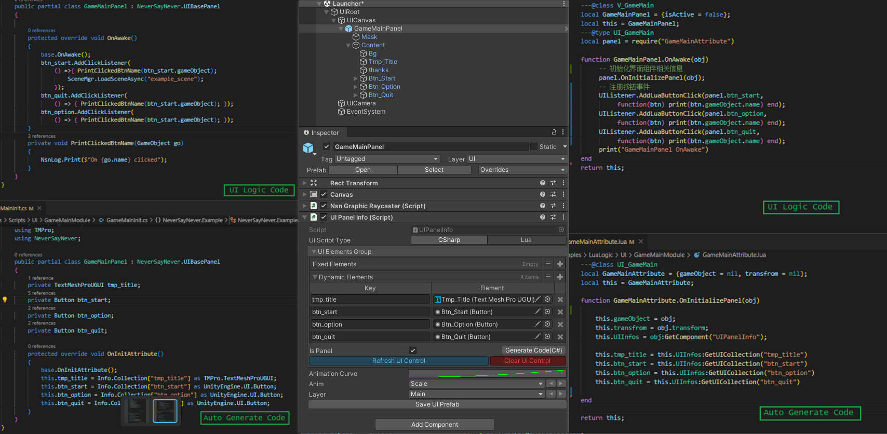

# NsnFramework For Unity
**Framework is Refactoring**
#
*Unity Version：2021.3.0f1c1*
## Dependent Plugins
- **[Odin Inspector](https://assetstore.unity.com/packages/tools/utilities/odin-inspector-and-serializer-89041) ---- need To pay**
- **[DOTween](https://assetstore.unity.com/packages/tools/animation/dotween-hotween-v2-27676) --- for free**
- **[xlua](https://github.com/Tencent/xLua) --- open source**

Just a sample ui exmaple with UGUI .  

### UI Inspector
How to build UIView ? These are something special in UI Inspector!
- *bind ui controls quickly through using **"Refresh UI Control"** button (extensible)*
- *generate ui view code automatic through **"Generate UI Code"** button (both c# and lua)*

It will work both in c# and lua , 

## Framework Example
*example path in project*
- Scene Example：Assets/NsnFramework/Examples/Scenes/ Example_Scene.unity -
- Framework Config Example：Assets/NsnFramework/Resources/Setting/ 

## And More
- one-touch to build project to Android or iOS platform
- more build-in development tools in framework
- try to build "Behaviour Designer" editor in framework , to be continue ..

